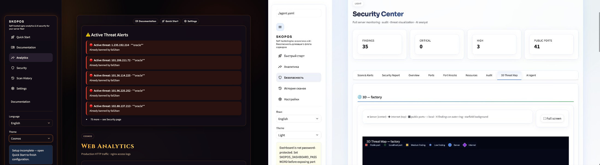
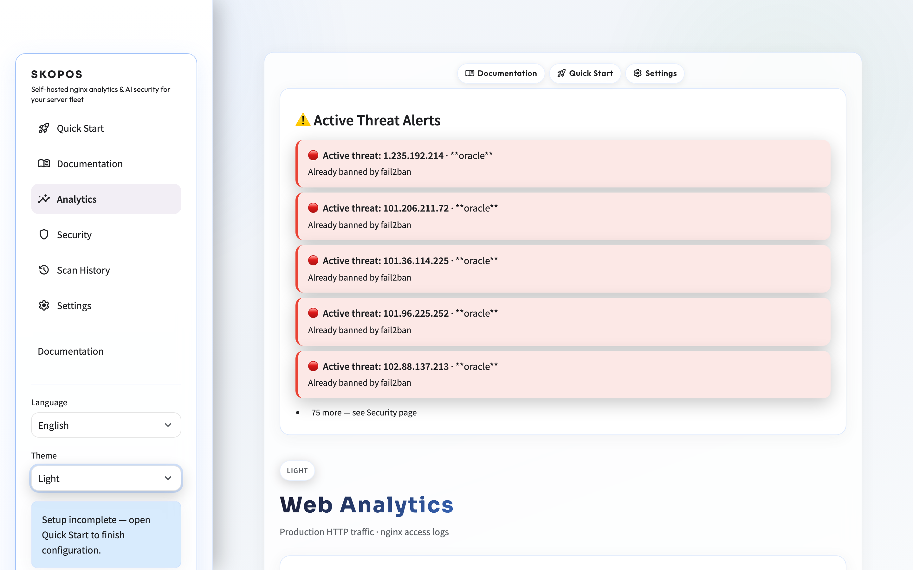
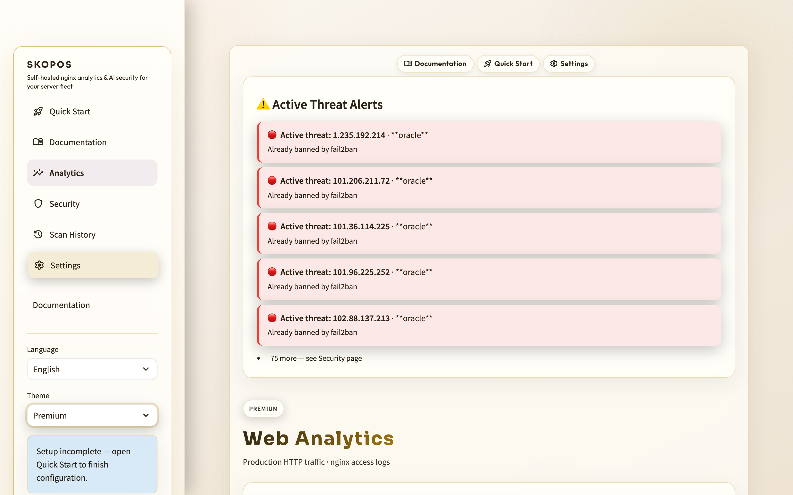
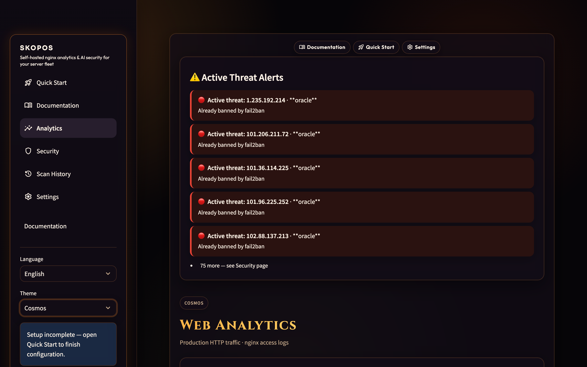
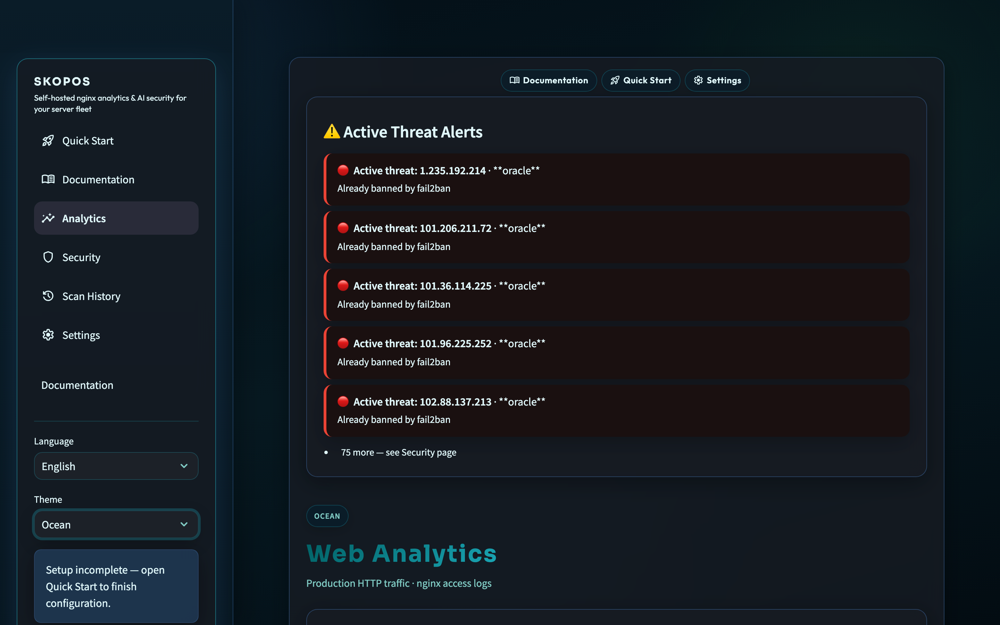
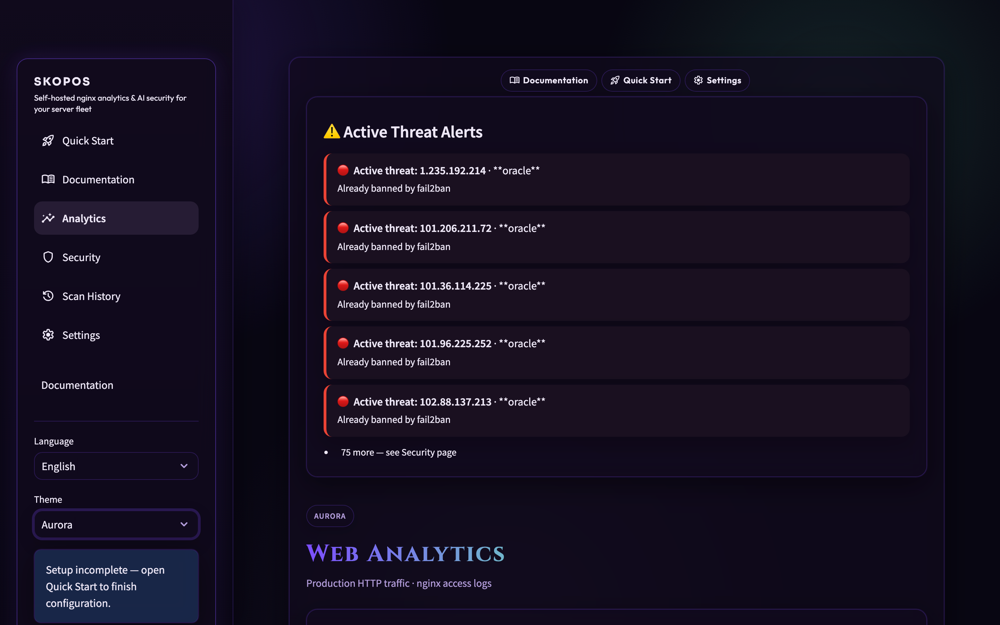
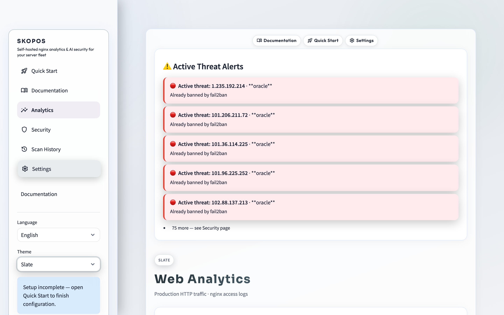
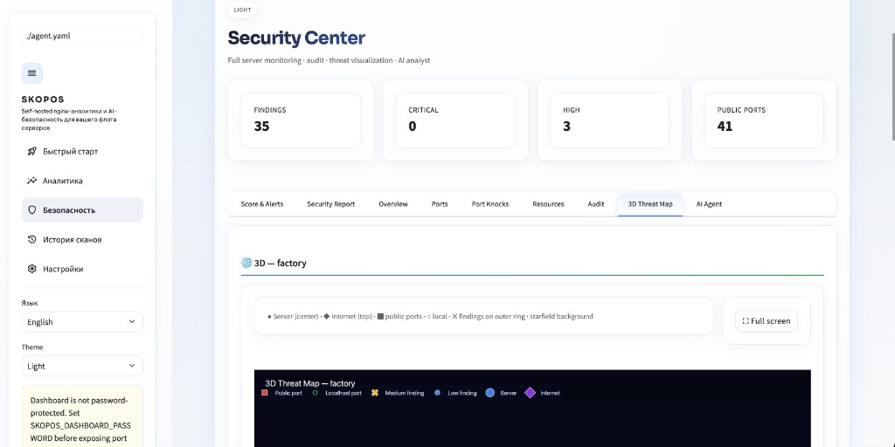
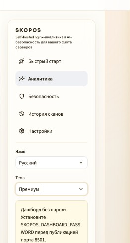
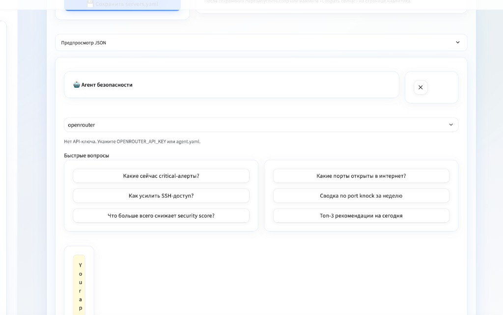

<!-- aicom-mirror-notice -->
> **📖 Read-only mirror.** `skopos` is published from the canonical AI-Factory monorepo.
> **Pull requests are not accepted** — any commit pushed here is overwritten by
> `scripts/mirror_satellites.sh` on the next sync.
> 🐞 Found a bug or have a request? Please **[open an issue](https://github.com/alexar76/skopos/issues)**.

# SKOPOS — fleet observability satellite of the AICOM ecosystem

<!-- aicom-readme-badges -->
<p align="center">
  <a href="https://github.com/alexar76/skopos/actions/workflows/ci.yml"></a>
  <a href="https://github.com/alexar76/skopos/actions/workflows/pages.yml"></a>
  <a href="https://skopos.modelmarket.dev/"></a>
  <a href="https://alexar76.github.io/skopos/"></a>
  =3.11" />
  
  
  <a href="docs/badges/coverage.svg"></a>
  <a href="LICENSE"></a>
</p>
<!-- /aicom-readme-badges -->


> **Self-hosted nginx & Apache analytics and AI security for your server fleet** — GA-like HTTP dashboards, Security Center with 3D threat map, scan history, and an AI agent with voice input. No third-party trackers; data stays on your infrastructure.

<p align="center">
  <a href="https://skopos.modelmarket.dev/app/">
    
  </a>
</p>

<p align="center">
  <strong><a href="https://skopos.modelmarket.dev">Live demo</a></strong>
  ·
  <strong><a href="https://alexar76.github.io/skopos/">Landing</a></strong>
  ·
  nine built-in themes
</p>

In Greek, **skopos** (σκοπός) means *watcher* or *scout*. **SKOPOS** is the fleet observability satellite of the [AICOM / AIMarket ecosystem](https://magic-ai-factory.com): nginx traffic over SSH, security posture across factory / metis / oracle hosts, and an LLM analyst in the sidebar.

| | |
|---|---|
| **Role** | SSH log collection → SQLite/PostgreSQL analytics → Security Center + AI agent |
| **Live demo** | [skopos.modelmarket.dev](https://skopos.modelmarket.dev) |
| **Landing (GitHub Pages)** | [alexar76.github.io/skopos](https://alexar76.github.io/skopos/) |
| **Monitors** | **nginx** access logs (primary), **Apache** combined, CPU/RAM/disk, ports, fail2ban, port knocks |
| **Charter** | Read-only SSH probes · self-hosted data · optional dashboard password |

### Features

- **Analytics** — nginx access logs over SSH, SQLite, Streamlit charts, traffic globe
- **Security** — CPU/RAM/disk/network, port audit, firewall, cyberpunk 3D threat map, consolidated **Security Report**
- **Scan History** — score timeline, findings trends, snapshot comparison
- **Auto-scan** — configurable background security scans (default every 60 min)
- **AI Agent** — OpenRouter (default), DeepSeek, OpenAI, Anthropic, Ollama, LM Studio; sidebar chat with voice input
- **i18n** — English (default), Russian, Spanish (`locales/`)

### Quick start

See [docs/quickstart.md](docs/quickstart.md).

```bash
cp servers.example.yaml servers.yaml
cp agent.example.yaml agent.yaml
export OPENROUTER_API_KEY=sk-or-...
python skoposctl.py collect
python skoposctl.py security-scan
streamlit run dashboard.py
```

| Page | URL |
|------|-----|
| Analytics | `http://localhost:8501` |
| Security | sidebar → **Security** |
| Scan History | sidebar → **Scan History** |
| Settings | sidebar → **Settings** |

### Security

- **Security Score** (0–100, grade A–F) in sidebar on every page
- **Threat alerts** banner when critical/high issues exist
- **SKOPOS_DASHBOARD_PASSWORD** — set before exposing the dashboard publicly
- **SKOPOS_SSH_STRICT_HOST_KEYS=1** — verify SSH host keys (recommended)
- See [docs/audit-findings.md](docs/audit-findings.md)

### Documentation

| Doc | Description |
|-----|-------------|
| **[In-app Documentation](http://localhost:8501/Documentation)** | Guides with screenshots (also in sidebar / top bar) |
| [Quick Start](docs/quickstart.md) | 5-minute setup |
| [User Guide](docs/user-guide.md) | Full UI reference |
| [Use Cases](docs/use-cases.md) | Common workflows |
| [Security Module](docs/security.md) | Architecture & extension |
| [nginx scope](docs/en/guide/nginx.md) | **Analytics are nginx-only** — disclaimer & log format |
| [CHANGELOG](CHANGELOG.md) | Release notes |

> **Analytics scope:** traffic dashboards parse **nginx access logs** by default. **Apache combined** logs are supported when `apache.enabled: true`. Security probes are stack-agnostic.

### Configure servers

Edit `servers.yaml` — SSH host, nginx log paths. See `servers.example.yaml`.

For per-domain analytics, include `$host` in nginx `log_format`.

### AI agent

Default provider: **OpenRouter** via `OPENROUTER_API_KEY`. Edit `agent.yaml` for DeepSeek, OpenAI, Anthropic, Ollama, or LM Studio.

For a full prioritized remediation report, open **Security → Security Report**. The sidebar agent supports follow-up chat (including voice) on every page.

### Docker

```bash
docker compose up -d --build
```

Open `http://localhost:8501`

### License

MIT — see [LICENSE](LICENSE).

### Testing & coverage

```bash
pip install -r requirements.txt pytest pytest-cov
bash scripts/ci_coverage_badge.sh -- tests/ -q --cov=skopos
```

**173** pytest cases · line coverage on `skopos/` tracked in [`docs/badges/coverage.svg`](docs/badges/coverage.svg) (regenerate with `bash scripts/ci_coverage_badge.sh`, verified by [CI](.github/workflows/ci.yml)).

### Screenshots

Captured from [skopos.modelmarket.dev](https://skopos.modelmarket.dev/app/) — Analytics page in six themes (sidebar **Theme** picker):

<p align="center">
  
  
</p>
<p align="center"><sub>Light · Premium</sub></p>

<p align="center">
  
  
</p>
<p align="center"><sub>Cosmos (midnight) · Ocean</sub></p>

<p align="center">
  
  
</p>
<p align="center"><sub>Aurora · Slate</sub></p>

| View | Screenshot |
|------|------------|
| Security — 3D Threat Map |  |
| Sidebar & navigation |  |
| Floating AI agent |  |

Regenerate hero + theme gallery from production:

```bash
export SKOPOS_DASHBOARD_PASSWORD='…'
pip install playwright pillow && playwright install chromium
python scripts/capture_readme_screenshots.py --base-url https://skopos.modelmarket.dev/app/
```
