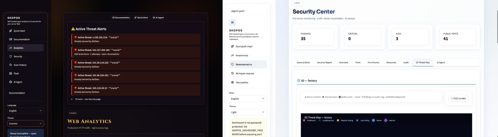
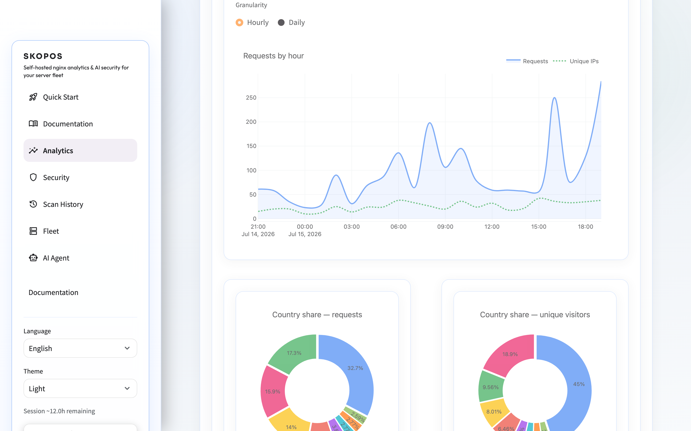
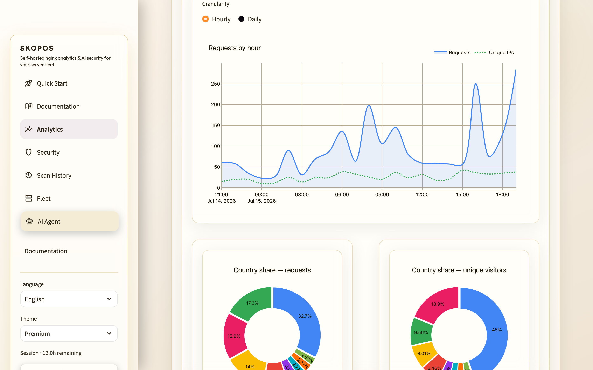
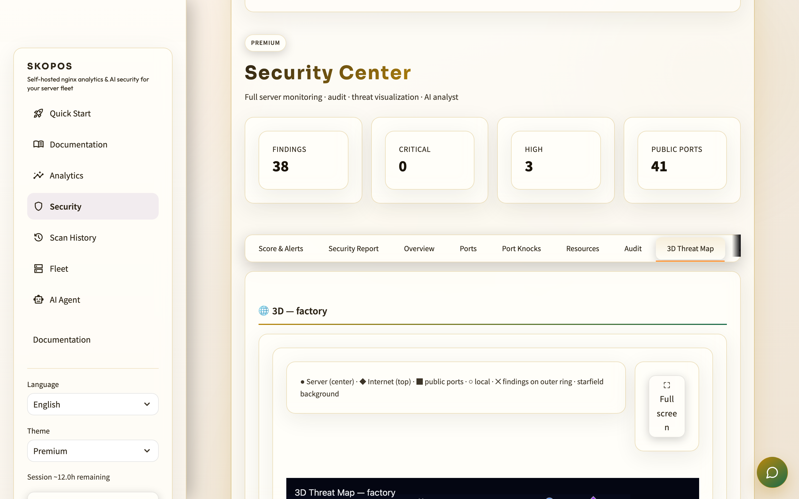
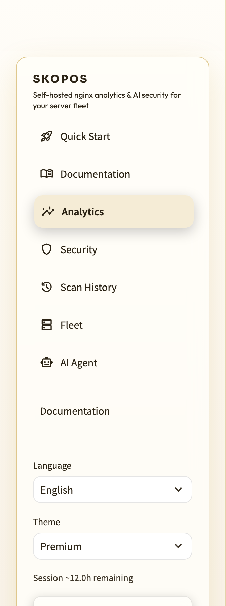
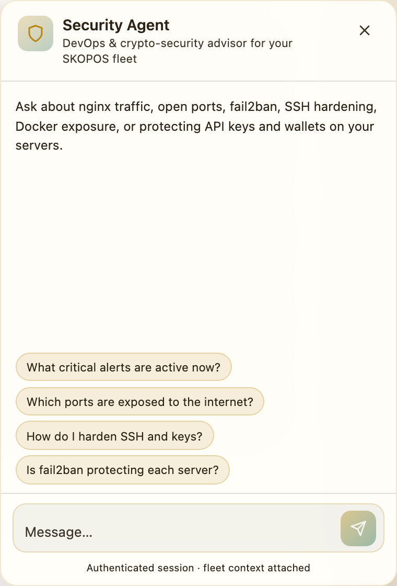

# SKOPOS — спутник наблюдаемости флота экосистемы AICOM

> 🌐 [English](../README.md) · **Русский** · [Español](README.es.md) · [Français](README.fr.md) · [中文](README.zh.md) · [Глоссарий](https://github.com/alexar76/aicom/blob/main/docs/localization-glossary.md)


> **Самостоятельно размещаемая аналитика nginx/Apache и AI-безопасность для серверного флота** — HTTP-дашборды в духе GA, Security Center с 3D-картой угроз, Prometheus Observability (APM KPI + 3D service graph), история сканов и AI-агент с голосовым вводом. Без сторонних трекеров; данные остаются на вашей инфраструктуре.

<p align="center">
  <a href="https://skopos.modelmarket.dev/app/">
    
  </a>
</p>

<p align="center">
  <strong><a href="https://skopos.modelmarket.dev">Живое демо</a></strong>
  ·
  <strong><a href="https://alexar76.github.io/skopos/">Лендинг</a></strong>
  ·
  девять встроенных тем
</p>

По-гречески **skopos** (σκοπός) — *наблюдатель* или *разведчик*. **SKOPOS** — спутник наблюдаемости флота [экосистемы AICOM / AIMarket](https://magic-ai-factory.com): трафик nginx по SSH, security posture на хостах factory / metis / oracle и LLM-аналитик в сайдбаре.

| | |
|---|---|
| **Роль** | Сбор логов по SSH → аналитика SQLite/PostgreSQL → Security Center + AI-агент |
| **Живое демо** | [skopos.modelmarket.dev](https://skopos.modelmarket.dev) |
| **Лендинг (GitHub Pages)** | [alexar76.github.io/skopos](https://alexar76.github.io/skopos/) |
| **Мониторит** | access-логи **nginx** (основное), **Apache** combined, CPU/RAM/disk, порты, fail2ban, port knocks |
| **Устав** | Read-only SSH-пробы · данные на своём сервере · опциональный пароль дашборда |

### Возможности

- **Analytics** — access-логи nginx по SSH, SQLite, графики Streamlit, глобус трафика
- **Security** — CPU/RAM/disk/сеть, аудит портов, файрвол, киберпанк 3D-карта угроз, сводный **Security Report**
- **Scan History** — таймлайн score, тренды findings, сравнение снимков
- **Auto-scan** — фоновые security-сканы (по умолчанию каждые 60 мин)
- **AI Agent** — OpenRouter (по умолчанию), DeepSeek, OpenAI, Anthropic, Ollama, LM Studio; чат в сайдбаре с голосом
- **i18n** — English (default), Russian, Spanish (`locales/`)

### Быстрый старт

См. [docs/quickstart.md](quickstart.md).

```bash
cp servers.example.yaml servers.yaml
cp agent.example.yaml agent.yaml
export OPENROUTER_API_KEY=sk-or-...
python skoposctl.py collect
python skoposctl.py security-scan
streamlit run dashboard.py
```

| Страница | URL |
|------|-----|
| Analytics | `http://localhost:8501` |
| Security | сайдбар → **Security** |
| Scan History | сайдбар → **Scan History** |
| Settings | сайдбар → **Settings** |

### Безопасность

- **Security Score** (0–100, оценка A–F) в сайдбаре на каждой странице
- Баннер **Threat alerts** при critical/high
- **Пароль дашборда** — только salted PBKDF2 **hash** в БД (env `SKOPOS_DASHBOARD_PASSWORD` для bootstrap). См. [configuration](en/guide/configuration.md)
- **SKOPOS_SSH_STRICT_HOST_KEYS=1** — проверка SSH host keys (рекомендуется)
- См. [docs/audit-findings.md](audit-findings.md)

### Документация

| Документ | Описание |
|-----|-------------|
| **[In-app Documentation](http://localhost:8501/Documentation)** | Гайды со скриншотами |
| [Quick Start](quickstart.md) | Установка за 5 минут |
| [User Guide](user-guide.md) | Полный UI |
| [Use Cases](use-cases.md) | Типовые сценарии |
| [Security Module](security.md) | Архитектура |
| [nginx scope](en/guide/nginx.md) | Аналитика **только nginx** по умолчанию |
| [CHANGELOG](../CHANGELOG.md) | Релиз-ноты |

> **Область аналитики:** дашборды трафика парсят **nginx access logs** по умолчанию. **Apache combined** — при `apache.enabled: true`. Security-пробы стек-агностичны.

### Настройка серверов

Правьте `servers.yaml` — SSH host, пути логов nginx. См. `servers.example.yaml`.
Для per-domain аналитики добавьте `$host` в nginx `log_format`.

### AI-агент

Провайдер по умолчанию: **OpenRouter** через `OPENROUTER_API_KEY`. Правьте `agent.yaml` для DeepSeek, OpenAI, Anthropic, Ollama или LM Studio.

Полный remediation-отчёт: **Security → Security Report**. Сайдбар-агент поддерживает follow-up (включая голос) на каждой странице.

### Docker

```bash
docker compose up -d --build
```

Откройте `http://localhost:8501`

### Лицензия

MIT — см. [LICENSE](../LICENSE).

### Тесты и покрытие

```bash
pip install -r requirements.txt pytest pytest-cov
bash scripts/ci_coverage_badge.sh -- tests/ -q --cov=skopos
```

**227** pytest · покрытие `skopos/` в [`docs/badges/coverage.svg`](badges/coverage.svg).

### Скриншоты

С [skopos.modelmarket.dev](https://skopos.modelmarket.dev/app/) — Analytics в шести темах:

<p align="center">
  
  
</p>

| Вид | Скриншот |
|------|------------|
| Security — 3D Threat Map |  |
| Сайдбар |  |
| Плавающий AI-агент |  |
