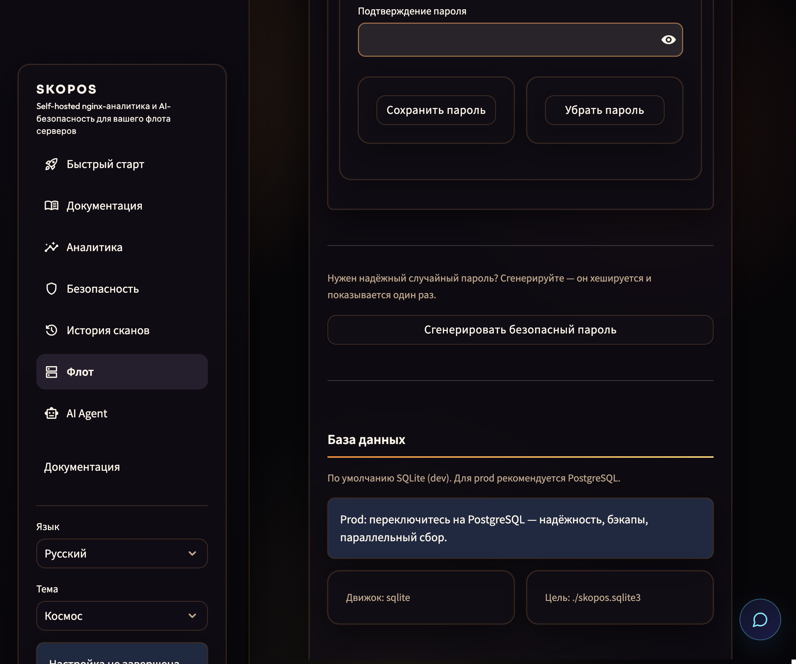
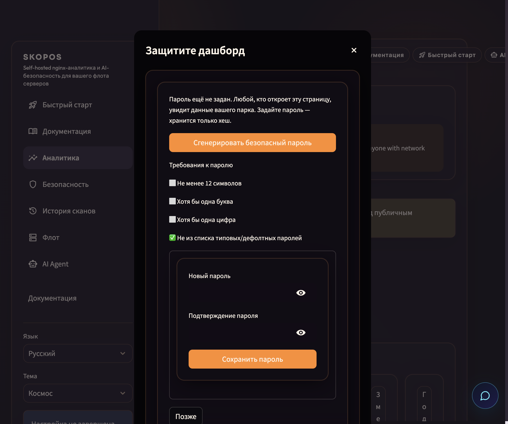

# Configuration

## `servers.yaml`

Each server entry describes SSH access and **nginx log paths**:

```yaml
servers:
  - name: factory
    source: ssh_nginx_access_log
    ssh:
      host: 203.0.113.10
      port: 22
      user: deploy
      key_path: ~/.ssh/id_rsa
    nginx:
      access_log_path: /var/log/nginx/access.log
      auto_discover_logs: true
      auto_discover_docker_logs: false
```

| Field | Purpose |
|------|--------|
| `name` | Label in dashboards and filters |
| `source` | `ssh_nginx_access_log` (nginx only) or `ssh_http_access_log` (nginx + optional Apache) |
| `nginx.access_log_path` | Primary access log file |
| `nginx.access_log_paths` | Extra log files (multi-site) |
| `nginx.auto_discover_logs` | Parse nginx configs on the host for more paths |
| `nginx.auto_discover_docker_logs` | Optional: also tail public Docker HTTP containers |

### Domains & subdomains (auto-discovery)

You don't list domains anywhere — SKOPOS groups every request by its **domain** (`host`) automatically, so each site and subdomain shows up on its own in Analytics (the **host** filter) and in threat alerts. The only requirement: the host's nginx must **log the vhost**. The stock *combined* format omits it, so add `$host` to `log_format` once and reload — no per-domain config, ever:

```nginx
# /etc/nginx/nginx.conf — inside the http { } block
log_format skopos '$host $remote_addr - $remote_user [$time_local] '
                  '"$request" $status $body_bytes_sent "$http_referer" "$http_user_agent"';

access_log /var/log/nginx/access.log skopos;
```

Then `sudo nginx -t && sudo nginx -s reload`. SKOPOS's parser accepts **both** the standard combined format and this `$host`-prefixed one, so existing log lines keep parsing during the switch. Add a new subdomain later? Nothing to do here — as soon as it serves traffic through the same nginx it appears on its own. (Per-vhost `access_log` files also work: point `nginx.access_log_paths` at them or leave `auto_discover_logs: true`.)

### Apache (optional)

Apache access logs use the same **combined/common** format as nginx, so SKOPOS
parses them with the same engine. Add an `apache:` block and set the server
`source` to `ssh_http_access_log`:

```yaml
servers:
  - name: metis
    source: ssh_http_access_log
    ssh:
      host: 203.0.113.20
      port: 22
      user: stats
      key_path: ~/.ssh/id_ed25519
    nginx:
      access_log_path: /var/log/nginx/access.log
      auto_discover_logs: true
    apache:
      enabled: true
      access_log_path: /var/log/apache2/access.log
      access_log_paths:                 # optional extra vhost logs (multi-site)
        - /var/log/apache2/api.example.com-access.log
      auto_discover_logs: true          # scan CustomLog/TransferLog directives
      auto_discover_docker_logs: false  # optional: tail public Docker HTTP containers
      docker_log_containers: []         # optional: explicit container names
```

| Field | Purpose |
|------|--------|
| `apache.enabled` | Turn Apache collection on for this server |
| `apache.access_log_path` | Primary Apache access log (fallback when nothing is discovered) |
| `apache.access_log_paths` | Extra vhost log files (multi-site) |
| `apache.auto_discover_logs` | Scan `CustomLog`/`TransferLog` directives across `sites-enabled`, `sites-available`, `conf-enabled`, `conf.d` (Debian **and** RHEL layouts) |
| `apache.auto_discover_docker_logs` | Optional: also tail public Docker HTTP containers |
| `apache.docker_log_containers` | Optional: explicit Docker container names |

Auto-discovery is **authoritative for Apache**: because access logs come only from
`CustomLog`/`TransferLog` directives (never `ErrorLog`), every discovered path is
kept — including vhost logs whose filename does not contain `access` (e.g.
`api.example.com.log`). The `${APACHE_LOG_DIR}` placeholder and piped loggers
(`|/usr/bin/rotatelogs …`) are handled: the placeholder is expanded to
`/var/log/apache2`, piped destinations are skipped (they are not tailable files).
Vhost host names are inferred from filenames like `example.com.access.log`,
`example.com-access.log`, `example.com_access.log`, and RHEL-style
`example.com-access_log`.

### Permissions

The SSH user must be able to **read the web-server log files** — nginx logs are
usually readable via the `adm` group on Debian/Ubuntu; Apache logs live under
`/var/log/apache2` (Debian) or `/var/log/httpd` (RHEL) and are typically group
`adm` or `root`, so add the SSH user accordingly.

## `agent.yaml`

LLM providers for the Security Report and floating agent. Default: **OpenRouter** via `OPENROUTER_API_KEY`.

## Environment variables

| Field | Purpose |
|------|--------|
| `SKOPOS_DASHBOARD_PASSWORD` | Bootstrap dashboard password (plaintext, legacy). Setting one in the admin panel stores a **hash** in the DB and supersedes this |
| `SKOPOS_DASHBOARD_PASSWORD_MIN_LENGTH` | Minimum length for new passwords (default **12**) |
| `SKOPOS_DASHBOARD_SESSION_HOURS` | Auto sign-out after N hours (default **12**) |
| `SKOPOS_DASHBOARD_PASSWORD_MAX_AGE_DAYS` | Rotate password after N days (default **90**; `0` disables reminders) |
| `SKOPOS_DASHBOARD_PASSWORD_WARN_DAYS` | Warn this many days before expiry (default **7**) |
| `OPENROUTER_API_KEY` | Default LLM provider |
| `SKOPOS_SSH_KEY_PASSPHRASE` | Passphrase for encrypted SSH keys |
| `SKOPOS_SSH_STRICT_HOST_KEYS` | `1` to verify host keys |

## Dashboard password & rotation

SKOPOS resolves the login password from three sources, in order:

1. **Hashed password in the database** — set from the **admin panel** (Fleet →
   Dashboard access), the first-run **wizard**, or the post-deploy **"Secure your
   dashboard"** modal. Only a salted PBKDF2-HMAC-SHA256 hash is stored; the
   plaintext never touches disk. This is the recommended source.
2. **`SKOPOS_DASHBOARD_PASSWORD`** env var — plaintext, for bootstrap / IaC.
3. **None** — the dashboard is open and a setup notice is shown on every page.

Setting a password in the UI writes the hash to the DB and strips the plaintext
line from `.env`, so a hash becomes the single source of truth.

**Setting / changing / regenerating:**

- **Set or change:** enter a new password (live rule checks: length, letter,
  digit, not a common password) → **Save password**.
- **Generate:** click **Generate secure password** — SKOPOS creates a strong
  random password, stores its hash, and reveals the plaintext **once** so you can
  save it in your password manager.
- **Remove:** **Remove password** clears the hash and reopens the dashboard.

**Rotation & expiry:** password age is tracked from the moment it was set. After
`SKOPOS_DASHBOARD_PASSWORD_MAX_AGE_DAYS` (default **90**) it is considered
expired; within `SKOPOS_DASHBOARD_PASSWORD_WARN_DAYS` (default **7**) the admin
panel shows a countdown. When Telegram notifications are enabled, an alert is
sent (at most once per day) as the password approaches or passes expiry. Set the
max-age to `0` to disable rotation reminders entirely.





## Where to change things in the UI

| Field | Purpose |
|------|--------|
| Language & theme | Sidebar bottom |
| Collection / backfill | Sidebar on **Analytics** |
| Auto-scan interval | **Settings** |
| Telegram alerts | **Settings** |
| Security agent provider | **Security** → AI Agent tab |

## Settings sections (detail)

| Field | Purpose |
|------|--------|
| Dashboard access | `SKOPOS_DASHBOARD_PASSWORD`, session hours, min length policy |
| Database | `SKOPOS_DATABASE_URL` or SQLite `db_path`; test + migrate in UI |
| Auto-scan | Background security scan interval (minutes) |
| Telegram | `SKOPOS_TELEGRAM_*` env vars; notify on new critical findings |
| SSH keys | Generate Ed25519; keys stored under `.skopos/ssh/` |
| Fleet servers | Visual editor for `servers.yaml` — nginx, Apache, docker logs |

## `agent.yaml` providers

Each provider block needs an API key env var. Default stack uses **OpenRouter** (`OPENROUTER_API_KEY`). Providers appear in Summary Report, floating agent, and Security → AI Agent tab.

| Provider | API key |
|------|--------|
| `openrouter` | `OPENROUTER_API_KEY` — default; many models via one key |
| `openai` | `OPENAI_API_KEY` |
| `anthropic` | `ANTHROPIC_API_KEY` |
| `deepseek` | `DEEPSEEK_API_KEY` |


## Floating AI assistant

After login every page shows a floating **Security Agent** — a gradient button in
the bottom-right corner that expands a chat panel *over* the page (bottom-right,
animated), the same feel as the AI-Factory assistant. It answers with the SKOPOS
knowledge base plus **live fleet context**: access-log traffic, suspicious paths,
security scans, findings, and Security-Score history.

**How it works**

- The panel is a self-contained widget; each message is a `POST /agent/chat` to
  the SKOPOS API server (same host, port `8502`). No page reload per message.
- Requests carry a short-lived **HMAC session token** minted for the
  authenticated dashboard session, so the endpoint only answers logged-in
  operators. The assistant is never shown or reachable before login.
- Answers use the configured `agent.yaml` providers with automatic fallback
  (see the provider table above).

**Deployment**

Expose the endpoint same-origin via nginx so the browser reaches it without CORS
(add next to the existing `/healthz` block):

```nginx
location /agent/ {
  proxy_pass http://127.0.0.1:8502;
  proxy_set_header Host $host;
  proxy_read_timeout 120;
}
```

| Variable | Purpose |
|------|--------|
| `SKOPOS_AGENT_TOKEN_SECRET` | Optional. HMAC secret shared by the UI + API. If unset, one is generated and persisted in the DB. |
| `SKOPOS_AGENT_API_BASE` | Optional. Override the assistant API base (default: same origin `/agent`). For split-host dev only, e.g. `http://localhost:8502`. |


