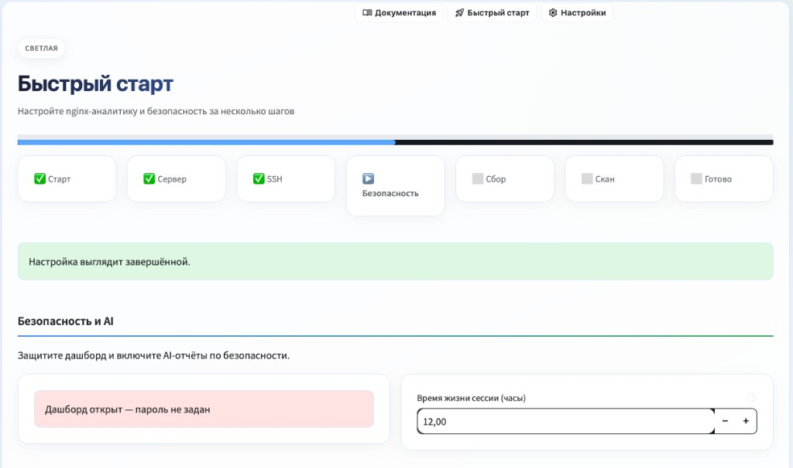
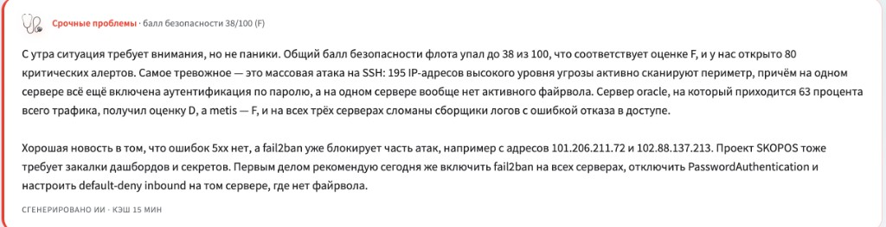
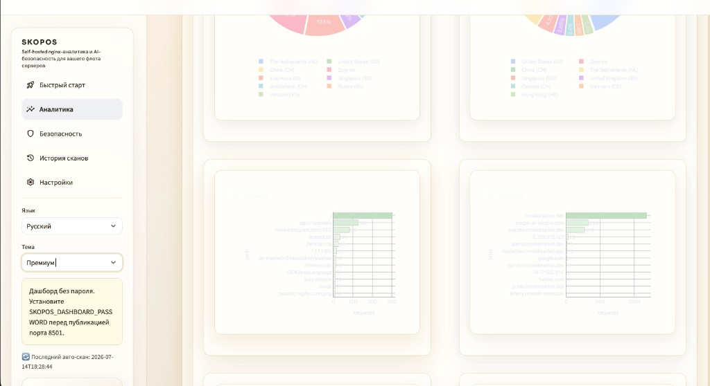
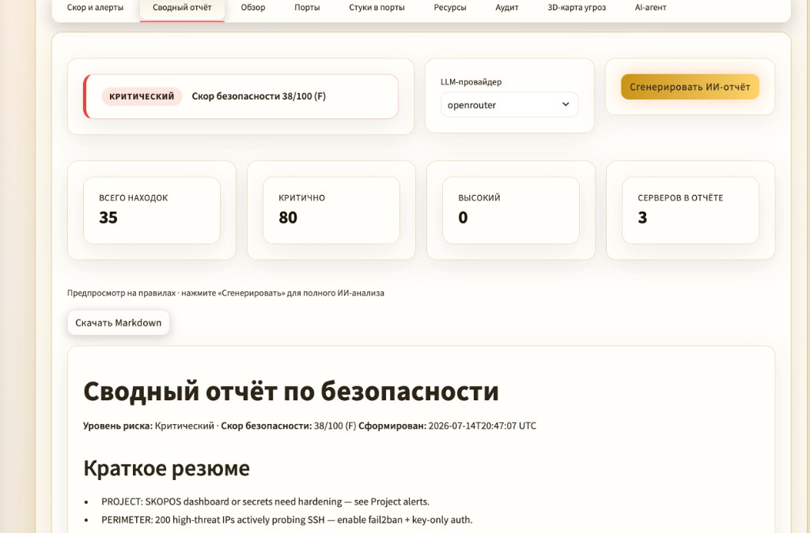
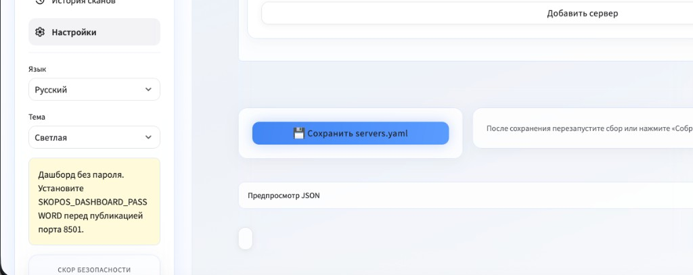
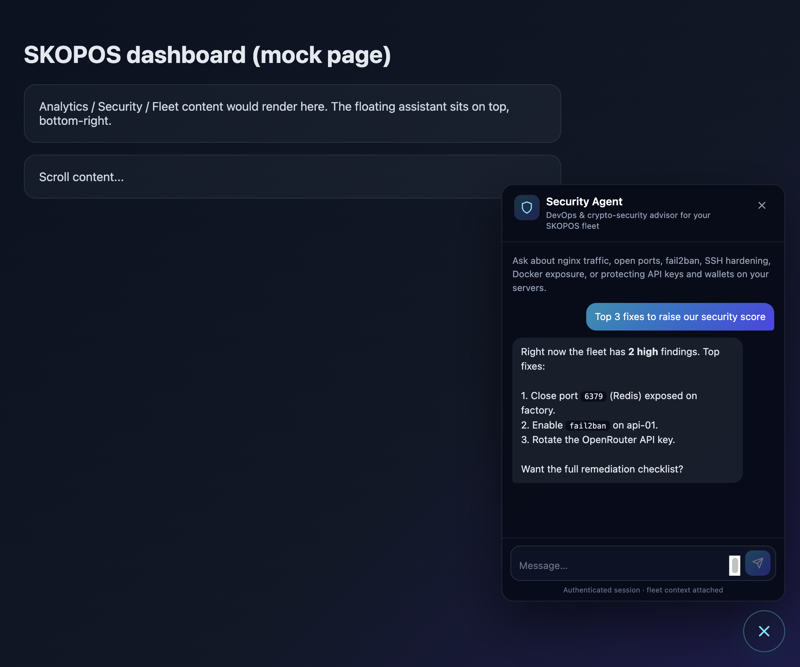

# Uso

Complete walkthrough of every SKOPOS page, tab, and control. Screenshots show the real UI; your fleet metrics will differ.

## Flujo diario

1. **Analítica** — tráfico, filtros, periodo (horas en **UTC**).
2. Anillo **Security Score** en la barra lateral.
3. **Seguridad** — puertos, fail2ban, informe.
4. **Historial de scans** — tendencia del score.
5. **Agente AI** — chat abajo a la derecha.

## Global shell (every page)

After login, these elements appear on every page:

- **Sidebar** — six main pages, language & theme pickers, security score ring, alert banner, auto-scan / Telegram captions, logout.
- **Top bar** — **Documentation**, **Quick Start**, **Settings** (left-aligned).
- **Alert banner** — up to five critical/high alerts with a link to **Security**.
- **Floating agent** — chat button bottom-right; opens on any page.


## Quick Start wizard

Sidebar → **Quick Start** or top bar. A six-step wizard for first-time setup:

1. **Welcome** — checklist: server, SSH, password, AI key, traffic collect, security scan.
2. **Server** — first fleet entry (name, host, user, port, nginx log path) → writes `servers.yaml`.
3. **SSH** — generate Ed25519 key, test connection, upload public key to the host.
4. **Security & AI** — set dashboard password, session hours, OpenRouter key, enable auto-scan.
5. **Collect** — run first log collection from the wizard.
6. **Scan** — run first security scan; **Done** links to Analytics, Security, Settings.

> You can skip the wizard anytime; **Settings** covers the same options. Incomplete setup shows a banner in the sidebar.




## Página Analítica

Home page (`dashboard.py`). Collects nginx access logs over SSH and renders traffic dashboards.

### Toolbar & sidebar controls

- **Period** — presets (day / week / month / 3 months / year) or custom relative/absolute range. All chart timestamps are **UTC**.
- **Filters** — hide bot scans, hide internal/service traffic, external IPs only; multiselect by server, host, country; path substring.
- **Sidebar** — override `servers.yaml` path; **Collect now** (incremental) and **Backfill all** (full history pull).

### AI Ecosystem briefing

- Card at the top summarises fleet mood, security score, collector status, and top risks.
- Uses `OPENROUTER_API_KEY` when set; falls back to rule-based text otherwise.
- Cached ~15 minutes; click refresh to regenerate.




### Analytics tabs

### Overview
- Traffic timeline (hour or day granularity).
- Country donuts — requests vs unique visitors.
- Top pages and hosts bar charts.
- Hourly heatmap (day × hour).
- HTTP status code distribution.
### Geography
- World map — metric toggle (requests / visitors); optional **3D globe** and fullscreen.
- Per-country bars, donuts, and timelines.
- Countries × hosts cross-chart and summary table.
- Requires GeoIP database (`geoip_mmdb_path` in config).
### Audience
- Browser/client, OS, and device donuts.
- Top visitor IPs bar chart.
### Content
- Page treemap (host → path hierarchy).
- Popular paths and hosts.
- Ecosystem segment traffic.
### Sources
- Top referer domains.
- Direct vs referred traffic metrics.
### Journal
- Visit log table — time, host, server IP, visitor IP, country, client, OS, device, method, path, status, referer (up to 1000 rows).
### System
- Per-server collector status — last OK time, rows inserted, last error.
- Resolved log sources (nginx files, Apache, docker container IDs).





## Página Seguridad

Sidebar → **Security**. SSH probes each server for ports, firewall, resources, auth logs, and Docker exposure.

- Override `agent.yaml` path.
- Filter by server or **Scan all servers** (sidebar button).

KPI row: **Findings**, **Critical**, **High**, **Public ports** — fleet-wide totals for the selected filter.

### Security tabs

### Score & Alerts
- Fleet score /100, letter grade, progress bar.
- Per-server score cards.
- Rule-based audit remarks.
- Expandable alert list — severity, message, remediation hint.
### Summary Report
- Risk badge (Critical / High / Medium / Low) and fleet score.
- **LLM provider** dropdown — from `agent.yaml` (default OpenRouter).
- **Generate AI report** — full markdown analysis; before that, a **rules preview** is shown.
- Metrics: total findings, critical, high, servers in report.
- **Download Markdown** — save the report for tickets or runbooks.
- Sections: executive summary, perimeter, project hardening, per-server notes.

### Overview
- Multi-server fleet chart.
- Per-server expander: CPU / memory / load gauges, findings bar, uptime, kernel snippet.
### Ports
- Visual port map per server.
- Table: protocol, port, address, bind scope, exposure (Open / Localhost / Other), process name.
- Raw `firewall_status` output.
### Port Knocks
- KPIs: events, unique IPs, top targeted port, high-threat count.
- Charts: top actors, actor types, by port, countries, timeline, heatmap.
- Actor table — IP, country, classification, threat score, hits, ports, servers.
- Event log (last 300 events) — SSH probes, firewall drops, fail2ban, web scans.
### Resources
- Per server: CPU %, memory %, load/cores % gauges; network I/O; disk usage charts.
### Audit
- Rule-based findings per server — severity, detail, recommendation.
- Auth log sample when failed SSH logins detected.
### 3D Threat Map
- Fullscreen 3D threat map per server.
- Legend: server (center), internet (top), public ports, localhost ports, findings on outer ring.

### AI Agent (tab)
- One-shot **Run AI audit** (separate from the floating chat agent).
- Provider picker and markdown result.
- For ongoing Q&A use the floating agent or **Summary Report**.


## Scan History

Sidebar → **Scan History**. Requires at least two scans for comparison features.

- History window slider — 7 to 90 days.
- Server filter — all servers or one host.

### Tabs

- **Timeline** — Score over time, scan activity calendar, fleet radar chart.
- **Trends** — Findings by severity over time.
- **Compare** — Pick scan A vs scan B — diff chart, new issues and resolved lists.
- **Log** — Table — time, server, findings, critical, high counts.

## Settings page

Sidebar or top bar → **Settings**. All fleet and dashboard configuration in one place.

- **Dashboard access** — Set/change/clear password, session hours, policy checklist.
- **Database** — SQLite vs PostgreSQL; test connection; apply URL and migrate data.
- **Auto-scan** — Enable toggle; interval 5–1440 minutes (default 60).
- **Telegram alerts** — Enable, chat ID, bot token env, notify interval, test send after scans.
- **SSH keys** — Key status; generate Ed25519/RSA (opens terminal on desktop).
- **Fleet servers** — Per-server expander — SSH, nginx/Apache/docker logs, test SSH, upload key, custom commands (requires `SKOPOS_ALLOW_CUSTOM_SSH_COMMANDS=1`).
- **Add server / Save** — Form for new host; **Save servers.yaml** writes config + optional `.env` tokens.




## Floating AI agent

Bottom-right chat button on every page. Multi-turn DevOps & security assistant with fleet context.

- Provider picker (from `agent.yaml`).
- **Quick questions** — critical alerts, open ports, SSH hardening, port-knock summary, top recommendations.
- Chat history within the session; **Clear** resets the thread.
- Context includes posture, recent scans, traffic summary (see `agent/context.py`).




## Three AI surfaces — when to use which

| Surface | Use when |
|------|--------|
| **AI Ecosystem briefing** (Analytics) | Daily fleet health paragraph; auto-refreshed. |
| **Summary Report** (Security → tab) | Formal markdown remediation brief; downloadable. |
| **Floating agent** (every page) | Interactive Q&A about alerts, ports, hardening. |
| **Security → AI Agent tab** | One-shot full audit run; not a chat. |

## CLI

```bash
python skoposctl.py collect
python skoposctl.py collect --full
python skoposctl.py security-scan
python skoposctl.py discover
```

## Barra superior

Enlaces a la derecha: **Documentación**, **Inicio rápido**, **Ajustes**.
